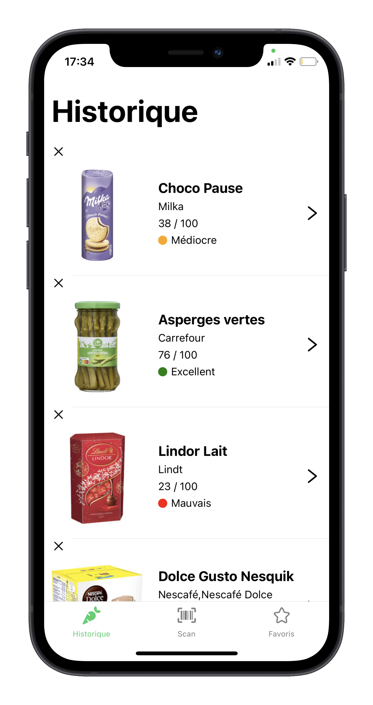
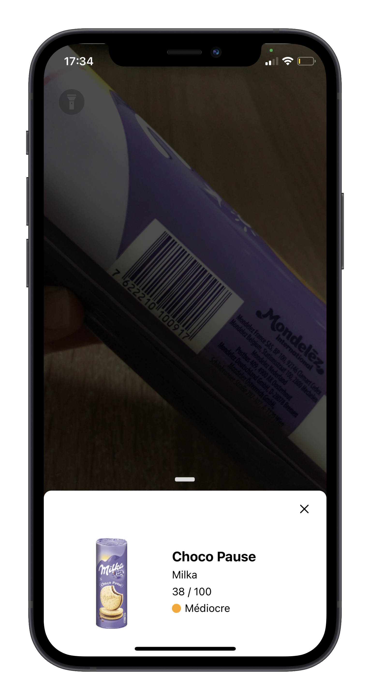
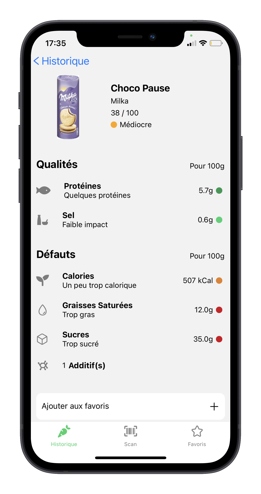

<h1 align="center">Yuka - Clone</h1>

## Overview

This project uses [OpenFoodFacts](https://fr.openfoodfacts.org/) API and allows you to :

- Scan a product ( torch mode available )
- See the nutritional values of the scanned product
- View the history of scanned products
- Manage your favorites products

&nbsp;

## Screenshots of application

<p align="center">



</p>

&nbsp;

## Running the project

First make sure you have installed all dependencies and applications to run project on your computer : [Getting Started with Expo](https://docs.expo.io/get-started/installation/).

The development was entirely done on iOS : Android compatibility isn't guaranteed (yet).

Clone this repository :

```
git clone https://github.com/LaetitiaConstant/yuka.git
cd yuka
```

Install packages :

```
yarn
```

When installation is complete, run the application :

```
expo start
```

You can download **Expo Go** on your mobile and scan code or open **iOS simulator**.
